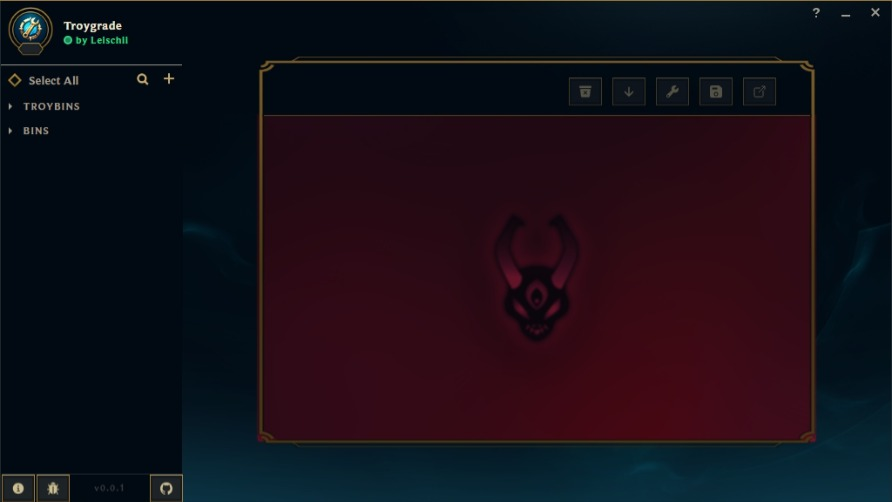

# Troygrade for desktop

This is a port for desktop of [Troygrade](https://github.com/Leischii/Leischii.github.io) made by [Leischii](https://github.com/Leischii), built with [Tauri](https://tauri.app/v1/guides/getting-started/setup/vite), [React](https://react.dev/learn) and [Vite](https://vitejs.dev/).
Troygrade is a tool created to help custom skin creators with bin files. Supports migrating troybin files, fixing outdated bin files and more to come in the future.

## Funcionalities

- Convert files (.troybin → .troy → .bin).
- Check output.
- Save formated bin as txt.

## Screenshot

